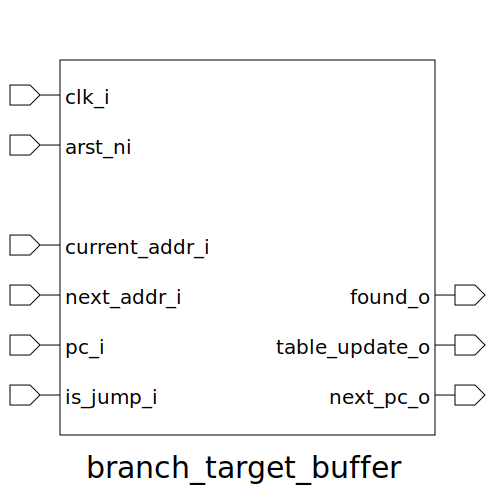

# branch_target_buffer (module)

### Author : Subhan Zawad Bihan (https://github.com/SubhanBihan)

## TOP IO

## Description

Write a markdown documentation for this systemverilog module:
 **This file is part of DSInnovators:rv64g-core**
 **Copyright (c) 2024 DSInnovators**
 **Licensed under the MIT License**
 **See LICENSE file in the project root for full license information**

## Parameters
|Name|Type|Dimension|Default Value|Description|
|-|-|-|-|-|
|addr_t|type||logic [63:0]||

## Ports
|Name|Direction|Type|Dimension|Description|
|-|-|-|-|-|
|clk_i|input|logic||Clock input|
|arst_ni|input|logic||Asynchronous Reset input|
|current_addr_i|input|addr_t||Current address (EXEC) input|
|next_addr_i|input|addr_t||Next address (EXEC) input|
|pc_i|input|addr_t||pc (IF) input|
|is_jump_i|input|logic||Is Jump/Branch (IF) input|
|found_o|output|logic||Found match in buffer output|
|table_update_o|output|logic||Table update event output|
|next_pc_o|output|addr_t||Next pc (in case of jump) output|
