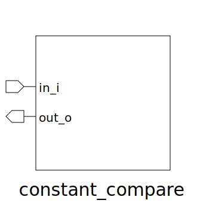

# constant_compare (module)

### Author : Foez Ahmed (https://github.com/foez-ahmed)

## TOP IO

## Description

This module generates simple AND gate for comparing a number with a constant expression. The output
of match is also predefined for both true and false.
 **This file is part of DSInnovators:rv64g-core**
 **Copyright (c) 2024 DSInnovators**
 **Licensed under the MIT License**
 **See LICENSE file in the project root for full license information**

## Parameters
|Name|Type|Dimension|Default Value|Description|
|-|-|-|-|-|
|IP_WIDTH|int||10|Width of the input signal|
|CMP_ENABLES|bit [IP_WIDTH-1:0]||'h0C3|Bitmask for comparison enable bits|
|EXP_RESULT|bit [IP_WIDTH-1:0]||'h082|Expected result for comparison|
|OP_WIDTH|int||2|Width of the output signal|
|MATCH_TRUE|bit [OP_WIDTH-1:0]||1|Output value when there is a match|
|MATCH_FALSE|bit [OP_WIDTH-1:0]||2|Output value when there is no match|

## Ports
|Name|Direction|Type|Dimension|Description|
|-|-|-|-|-|
|in_i|input|logic [IP_WIDTH-1:0]||Input signal|
|out_o|output|logic [OP_WIDTH-1:0]||Output signal|
