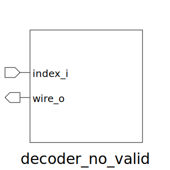

# decoder_no_valid (module)

### Author : Foez Ahmed (https://github.com/foez-ahmed)

## TOP IO

## Description

 **This file is part of DSInnovators:rv64g-core**
 **Copyright (c) 2024 DSInnovators**
 **Licensed under the MIT License**
 **See LICENSE file in the project root for full license information**

## Parameters
|Name|Type|Dimension|Default Value|Description|
|-|-|-|-|-|
|NUM_WIRE|int||4|Number of output wires|

## Ports
|Name|Direction|Type|Dimension|Description|
|-|-|-|-|-|
|index_i|input|logic [$clog2(NUM_WIRE)-1:0]||Input index|
|wire_o|output|logic [ NUM_WIRE-1:0]||Output wires|
