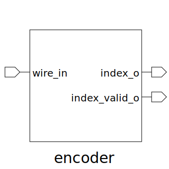

# encoder (module)

### Author : Foez Ahmed (https://github.com/foez-ahmed)

## TOP IO

## Description

The encoder module is designed to take a one-hot encoded input vector (wire_in) and generate a
binary index (index_o) corresponding to the position of the active input wire. It employs OR gates
to perform a hierarchical reduction of the input signals, ultimately determining the index of the
active wire. This module is intended to work with one-hot encoded inputs and will produce incorrect
results if multiple inputs are active simultaneously.
 **This file is part of DSInnovators:rv64g-core**
 **Copyright (c) 2024 DSInnovators**
 **Licensed under the MIT License**
 **See LICENSE file in the project root for full license information**

## Parameters
|Name|Type|Dimension|Default Value|Description|
|-|-|-|-|-|
|NUM_WIRE|int||16|Number of input wires|

## Ports
|Name|Direction|Type|Dimension|Description|
|-|-|-|-|-|
|wire_in|input|logic [NUM_WIRE-1:0]||Input vector of wires|
|index_o|output|logic [$clog2(NUM_WIRE)-1:0]||Output index of the highest priority wire|
