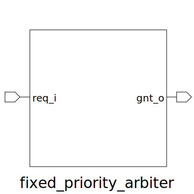

# fixed_priority_arbiter (module)

### Author : Foez Ahmed (foez.official@gmail.com)

## TOP IO

## Description

The fixed_priority_arbiter module manages multiple request signals and grants access based on a
fixed priority system. It ensures that the highest priority request is serviced first, by generating
grant signals for the active request with the highest priority. This is useful in systems where
certain tasks need to be prioritized over others to ensure efficient resource allocation and system
performance. The module is parameterized to handle a configurable number of request signals,
providing flexibility for various applications.

## Parameters
|Name|Type|Dimension|Default Value|Description|
|-|-|-|-|-|
|NUM_REQ|int||4|Number of requests|

## Ports
|Name|Direction|Type|Dimension|Description|
|-|-|-|-|-|
|req_i|input|logic [NUM_REQ-1:0]||Request inputs|
|gnt_o|output|logic [NUM_REQ-1:0]||Grant outputs|
