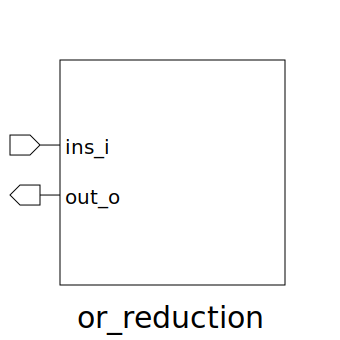

# or_reduction (module)

### Author : Foez Ahmed (https://github.com/foez-ahmed)

## TOP IO

## Description

OR reduction module
 **This file is part of DSInnovators:rv64g-core**
 **Copyright (c) 2024 DSInnovators**
 **Licensed under the MIT License**
 **See LICENSE file in the project root for full license information**

## Parameters
|Name|Type|Dimension|Default Value|Description|
|-|-|-|-|-|
|NUM_ELEM|int||4|Number of elements in the input array|
|ELEM_WIDTH|int||8|Width of each element in the input array|

## Ports
|Name|Direction|Type|Dimension|Description|
|-|-|-|-|-|
|ins_i|input|logic [ELEM_WIDTH-1:0]|[NUM_ELEM]|2D array input signal|
|out_o|output|logic [ELEM_WIDTH-1:0]||Output signal after OR reduction|
