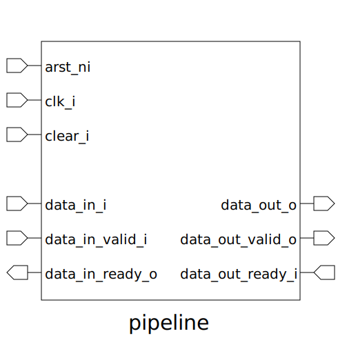

# pipeline (module)

### Author : Foez Ahmed (foez.official@gmail.com)

## TOP IO

## Description

The purpose of the pipeline module is to manage data flow in a pipelined system. It handles data
input and output through handshaking signals, ensuring proper synchronization and data integrity.
The module is parameterizable for different data widths and includes mechanisms to reset and clear
internal states, making it a flexible component for various hardware designs. Its main
functionalities include:
- Accepting input data when valid and ready
- Transferring data to output when conditions are met
- Managing internal state with flags to indicate if the pipeline stage is full or ready

This ensures efficient and controlled data processing within the pipeline.

## Parameters
|Name|Type|Dimension|Default Value|Description|
|-|-|-|-|-|
|DW|int||8|Data width parameter|

## Ports
|Name|Direction|Type|Dimension|Description|
|-|-|-|-|-|
|arst_ni|input|logic||Asynchronous reset, active low|
|clk_i|input|logic||Clock input|
|clear_i|input|logic||Synchronous clear signal|
|data_in_i|input|logic [DW-1:0]||Input data|
|data_in_valid_i|input|logic||Input data valid signal|
|data_in_ready_o|output|logic||Input data ready signal|
|data_out_o|output|logic [DW-1:0]||Output data|
|data_out_valid_o|output|logic||Output data valid signal|
|data_out_ready_i|input|logic||Output data ready signal|
