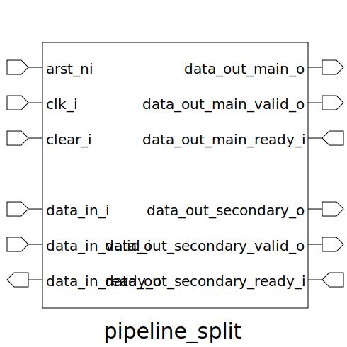

# pipeline_split (module)

### Author : Foez Ahmed (foez.official@gmail.com)

## TOP IO

## Description

The pipeline_split module is designed to manage data flow in a pipelined system and split the
processed data into two separate output paths: a main output and a secondary output. It ensures
proper synchronization and data integrity using handshaking signals. The module can handle various
data widths, supports asynchronous reset and synchronous clear signals, and internally instantiates
a pipeline module to process the data while directing the output to multiple destinations.
This allows for efficient and controlled data distribution in hardware designs.

## Parameters
|Name|Type|Dimension|Default Value|Description|
|-|-|-|-|-|
|DW|int||8|Data width parameter|

## Ports
|Name|Direction|Type|Dimension|Description|
|-|-|-|-|-|
|arst_ni|input|logic||Asynchronous reset, active low|
|clk_i|input|logic||Clock input|
|clear_i|input|logic||Synchronous clear signal|
|data_in_i|input|logic [DW-1:0]||Input data|
|data_in_valid_i|input|logic||Input data valid signal|
|data_in_ready_o|output|logic||Input data ready signal|
|data_out_main_o|output|logic [DW-1:0]||Main output data|
|data_out_main_valid_o|output|logic||Main output data valid signal|
|data_out_main_ready_i|input|logic||Main output data ready signal|
|data_out_secondary_o|output|logic [DW-1:0]||Secondary output data|
|data_out_secondary_valid_o|output|logic||Secondary output data valid signal|
|data_out_secondary_ready_i|input|logic||Secondary output data ready signal|
