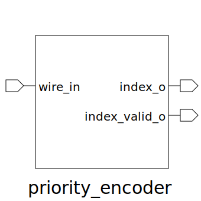

# priority_encoder (module)

### Author : Foez Ahmed (https://github.com/foez-ahmed)

## TOP IO

## Description

The priority_encoder module's primary purpose is to encode an input vector of signals, determining
the index of the highest priority active input wire. It achieves this by first using a fixed
priority arbiter to generate a one-hot encoded signal of the highest priority request. This one-hot
encoded signal is then passed to a simple encoder module, which converts it into a binary index
representing the active input wire.
 **This file is part of DSInnovators:rv64g-core**
 **Copyright (c) 2024 DSInnovators**
 **Licensed under the MIT License**
 **See LICENSE file in the project root for full license information**

## Parameters
|Name|Type|Dimension|Default Value|Description|
|-|-|-|-|-|
|NUM_WIRE|int||16|Number of input wires|

## Ports
|Name|Direction|Type|Dimension|Description|
|-|-|-|-|-|
|wire_in|input|logic [NUM_WIRE-1:0]||Input vector of wires|
|index_o|output|logic [$clog2(NUM_WIRE)-1:0]||Output index of the highest priority wire|
