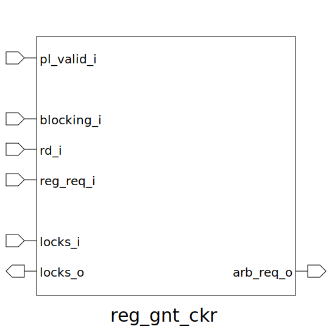

# reg_gnt_ckr (module)

### Author : Subhan Zawad Bihan (https://github.com/SubhanBihan)

## TOP IO

## Description

It handles register locking and arbitration in a pipelined environment for a RISC-V core. The module
ensures that necessary registers are locked/unlocked based on the current pipeline state and the
requirements of instructions being executed.
 **This file is part of DSInnovators:rv64g-core**
 **Copyright (c) 2024 DSInnovators**
 **Licensed under the MIT License**
 **See LICENSE file in the project root for full license information**

## Parameters
|Name|Type|Dimension|Default Value|Description|
|-|-|-|-|-|
|NR|int||rv64g_pkg::NUM_REGS|Number of registers|

## Ports
|Name|Direction|Type|Dimension|Description|
|-|-|-|-|-|
|pl_valid_i|input|logic|| 1 for valid instruction from pipeline.|
|blocking_i|input|logic|| For blocking instructions. If 1, lock all registers.|
|rd_i|input|logic [$clog2(NR)-1:0]|| Index of destination register.|
|reg_req_i|input|logic [ NR-1:0]|| Has 1s at the bits indicating required source registers by the current instruction.|
|locks_i|input|logic [NR-1:0]|| Input of locked registers.|
|locks_o|output|logic [NR-1:0]|| Output of locked registers. Note that when blocking_i = 0, rd_i = 0 register can never be locked (only exception) - otherwise lock register indicated by rd_i.|
|arb_req_o|output|logic|| 0/1 to arbiter based on locks_i and source registers required (all required source registers must be un-locked to "pass").|
