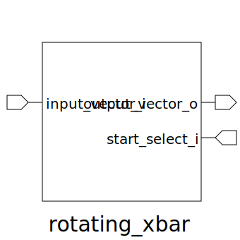

# rotating_xbar (module)

### Author : Foez Ahmed (foez.official@gmail.com)

## TOP IO

## Description

The rotating_xbar module is designed to act as a rotating crossbar switch, enabling dynamic routing
of data from multiple input lines to multiple output lines. The key feature of this module is its
ability to cyclically rotate the selection of input sources for the outputs based on a specified
starting index (start_select_i). This rotation ensures balanced and efficient data distribution
among the outputs, making it useful in communication systems and digital designs that require
flexible and dynamic data routing. The module leverages an instantiated crossbar switch (xbar) and
calculates the selection indices dynamically to achieve the desired rotation.

## Parameters
|Name|Type|Dimension|Default Value|Description|
|-|-|-|-|-|
|NUM_DATA|int||4|Number of data lines|
|DATA_WIDTH|int||4|Width of each data line|

## Ports
|Name|Direction|Type|Dimension|Description|
|-|-|-|-|-|
|input_vector_i|input|logic [NUM_DATA-1:0][DATA_WIDTH-1:0]||Input data vectors|
|output_vector_o|output|logic [ NUM_DATA-1:0][DATA_WIDTH-1:0]||Output data vectors|
|start_select_i|input|logic [$clog2(NUM_DATA)-1:0]||Start selection index|
