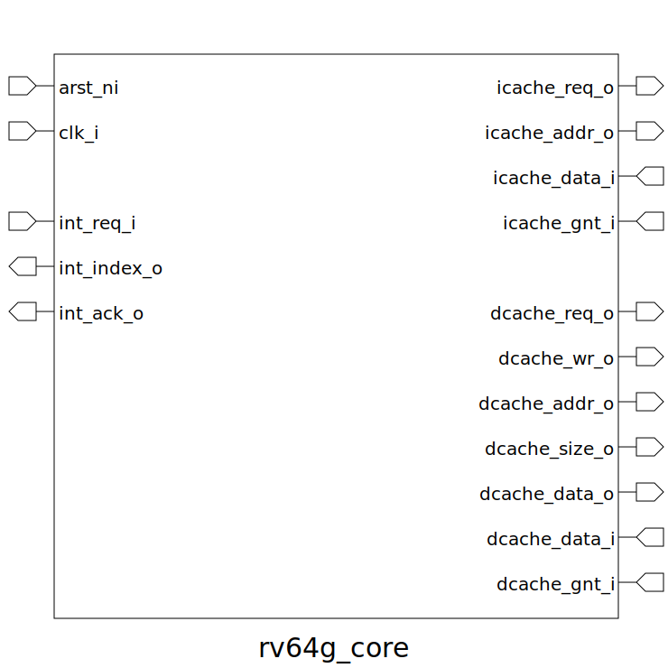

# rv64g_core (module)

### Author : Foez Ahmed (https://github.com/foez-ahmed)

## TOP IO

## Description

The rv64g_core module is designed to interface with instruction and data caches in a RISC-V 64-bit
architecture. It handles memory requests, data transfers, and interrupt management, making it
essential for efficient processor operation. Here's a detailed description of its functionality:
- **Memory Requests**: Manages requests to instruction and data caches, ensuring proper data flow
  between the processor and memory.
- **Data Transfers**: Handles data transfers to and from the caches, including specifying the
  address and size of the data.
- **Interrupt Management**: Processes interrupt requests, determines the active interrupt, and
  acknowledges interrupts, ensuring timely and efficient interrupt handling.
 **This file is part of DSInnovators:rv64g-core**
 **Copyright (c) 2024 DSInnovators**
 **Licensed under the MIT License**
 **See LICENSE file in the project root for full license information**

## Parameters
|Name|Type|Dimension|Default Value|Description|
|-|-|-|-|-|
|AW|int||64|Address width|
|ICDW|int||32|I-Cache data width|
|DCDW|int||64|D-Cache data width|

## Ports
|Name|Direction|Type|Dimension|Description|
|-|-|-|-|-|
|arst_ni|input|logic||Asynchronous reset, active low|
|clk_i|input|logic||Clock input|
|icache_req_o|output|logic||I-Cache request signal|
|icache_addr_o|output|logic [ AW-1:0]||I-Cache address output|
|icache_data_i|input|logic [ICDW-1:0]||I-Cache data input|
|icache_gnt_i|input|logic||I-Cache grant signal|
|dcache_req_o|output|logic||D-Cache request signal|
|dcache_wr_o|output|logic||D-Cache write/read signal|
|dcache_addr_o|output|logic [ AW-1:0]||D-Cache address output|
|dcache_size_o|output|logic [ 1:0]||D-Cache size output|
|dcache_data_o|output|logic [DCDW-1:0]||D-Cache data output|
|dcache_data_i|input|logic [DCDW-1:0]||D-Cache data input|
|dcache_gnt_i|input|logic||D-Cache grant signal|
|int_req_i|input|logic [31:0]||Interrupt request signals|
|int_index_o|output|logic [ 4:0]||Interrupt index output|
|int_ack_o|output|logic||Interrupt acknowledge signal|
