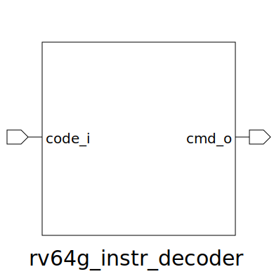

# rv64g_instr_decoder (module)

### Author : Foez Ahmed (https://github.com/foez-ahmed)

## TOP IO

## Description

Write a markdown documentation for this systemverilog module:
 **This file is part of DSInnovators:rv64g-core**
 **Copyright (c) 2024 DSInnovators**
 **Licensed under the MIT License**
 **See LICENSE file in the project root for full license information**

## Parameters
|Name|Type|Dimension|Default Value|Description|
|-|-|-|-|-|
|decoded_instr_t|type||rv64g_pkg::decoded_instr_t| type definition of decoded instruction|

## Ports
|Name|Direction|Type|Dimension|Description|
|-|-|-|-|-|
|code_i|input|logic [31:0]|| 32-bit input instruction code|
|cmd_o|output|decoded_instr_t|| Output decoded instruction|
