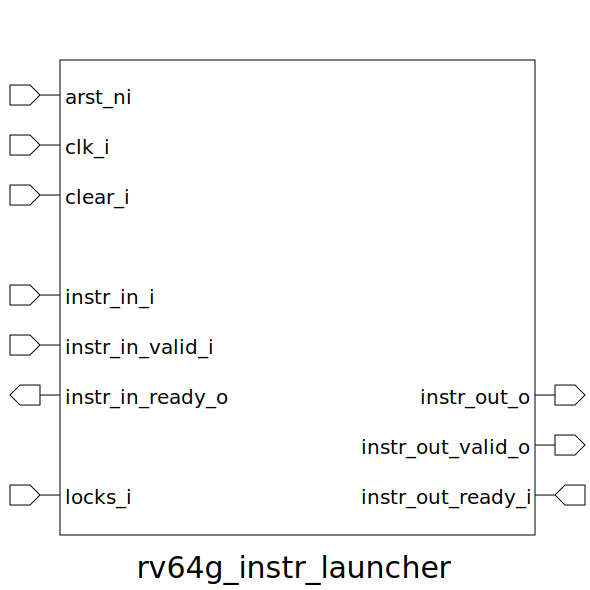

# rv64g_instr_launcher (module)

### Author : Foez Ahmed (https://github.com/foez-ahmed)

## TOP IO

## Description

The rv64g_instr_launcher module manages the instructions heading for execution. It temporarily store
instructions, checks register availability, and launches them for execution avoiding hazzards.

 **This file is part of DSInnovators:rv64g-core**
 **Copyright (c) 2024 DSInnovators**
 **Licensed under the MIT License**
 **See LICENSE file in the project root for full license information**

## Parameters
|Name|Type|Dimension|Default Value|Description|
|-|-|-|-|-|
|decoded_instr_t|type||rv64g_pkg::decoded_instr_t|Type for decoded instructions|
|NR|int||rv64g_pkg::NUM_REGS|Number of registers|
|locks_t|type||logic [NR-1:0]|Type for lock signals|

## Ports
|Name|Direction|Type|Dimension|Description|
|-|-|-|-|-|
|arst_ni|input|logic||Asynchronous reset, active low|
|clk_i|input|logic||Clock input|
|clear_i|input|logic||Synchronous clear signal|
|instr_in_i|input|decoded_instr_t||Incoming decoded instruction|
|instr_in_valid_i|input|logic||Valid signal for incoming instruction|
|instr_in_ready_o|output|logic||Ready signal for incoming instruction|
|locks_i|input|locks_t||Input lock signals for registers from regfile|
|instr_out_o|output|decoded_instr_t||Outgoing decoded instruction|
|instr_out_valid_o|output|logic||Valid signal for outgoing instruction|
|instr_out_ready_i|input|logic||Ready signal for outgoing instruction|
