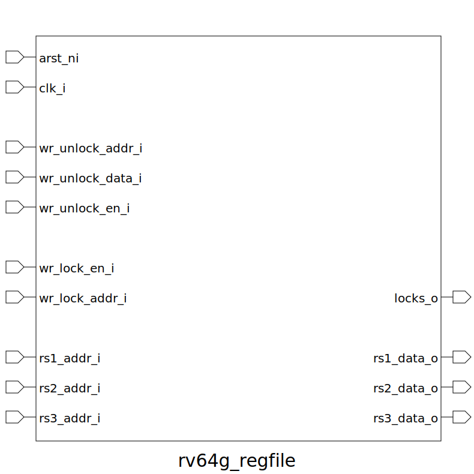

# rv64g_regfile (module)

### Author : Foez Ahmed (foez.official@gmail.com)

## TOP IO

## Description

The rv64g_regfile module is designed to implement a register file with 64 registers, each 64 bits
wide, for the RISC-V 64-bit architecture. This module supports locking and unlocking specific
registers, making it suitable for operations that require controlled access to the registers.
 **This file is part of DSInnovators:rv64g-core**
 **Copyright (c) 2024 DSInnovators**
 **Licensed under the MIT License**
 **See LICENSE file in the project root for full license information**

## Parameters
|Name|Type|Dimension|Default Value|Description|
|-|-|-|-|-|
|NR|int||64|Number of registers|
|DW|int||64|Data/Register Width|
|AW|int||$clog2(NR)|Address Width (log base 2 of the number of registers)|

## Ports
|Name|Direction|Type|Dimension|Description|
|-|-|-|-|-|
|arst_ni|input|logic||Asynchronous reset, active low|
|clk_i|input|logic||Clock input|
|wr_unlock_addr_i|input|logic [AW-1:0]||Address for writing data to unlock a register|
|wr_unlock_data_i|input|logic [DW-1:0]||Data to write to the register|
|wr_unlock_en_i|input|logic||Enable signal for writing unlock data|
|wr_lock_en_i|input|logic||Enable signal for locking a register|
|wr_lock_addr_i|input|logic [AW-1:0]||Address of the register to lock|
|rs1_addr_i|input|logic [AW-1:0]||Address of the first source register|
|rs2_addr_i|input|logic [AW-1:0]||Address of the second source register|
|rs3_addr_i|input|logic [AW-1:0]||Address of the third source register|
|locks_o|output|logic [NR-1:0]||Output vector indicating the lock status of each register|
|rs1_data_o|output|logic [DW-1:0]||Data output from the first source register|
|rs2_data_o|output|logic [DW-1:0]||Data output from the second source register|
|rs3_data_o|output|logic [DW-1:0]||Data output from the third source register|
