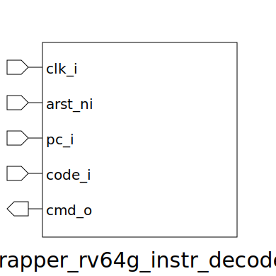

# wrapper_rv64g_instr_decoder (module)

### Author : 

## TOP IO

## Description

## Parameters
|Name|Type|Dimension|Default Value|Description|
|-|-|-|-|-|
|XLEN|int||rv64g_pkg::XLEN||
|decoded_instr_t|type||rv64g_pkg::decoded_instr_t||

## Ports
|Name|Direction|Type|Dimension|Description|
|-|-|-|-|-|
|clk_i|input|logic|||
|arst_ni|input|logic|||
|pc_i|input|logic [XLEN-1:0]|||
|code_i|input|logic [ 31:0]|||
|cmd_o|output|decoded_instr_t|||
