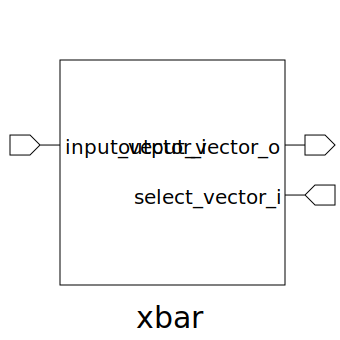

# xbar (module)

### Author : Foez Ahmed (foez.official@gmail.com)

## TOP IO

## Description

The xbar (crossbar switch) module is designed to manage data routing between multiple input and
output ports. It allows each output port to independently select and receive data from any of the
input ports based on a selection vector. This module is useful in communication systems and digital
designs where flexible and efficient data routing is required, ensuring that data from any input can
be directed to any output based on specified criteria.

## Parameters
|Name|Type|Dimension|Default Value|Description|
|-|-|-|-|-|
|NUM_INPUT|int||4|Number of input ports|
|NUM_OUTPUT|int||4|Number of output ports|
|DATA_WIDTH|int||4|Width of the data bus|

## Ports
|Name|Direction|Type|Dimension|Description|
|-|-|-|-|-|
|input_vector_i|input|logic [NUM_INPUT-1:0][DATA_WIDTH-1:0]|| Input data vectors|
|output_vector_o|output|logic [NUM_OUTPUT-1:0][DATA_WIDTH-1:0]|| Output data vectors|
|select_vector_i|input|logic [NUM_OUTPUT-1:0][$clog2(NUM_OUTPUT)-1:0]|| Selection vector for each output|
